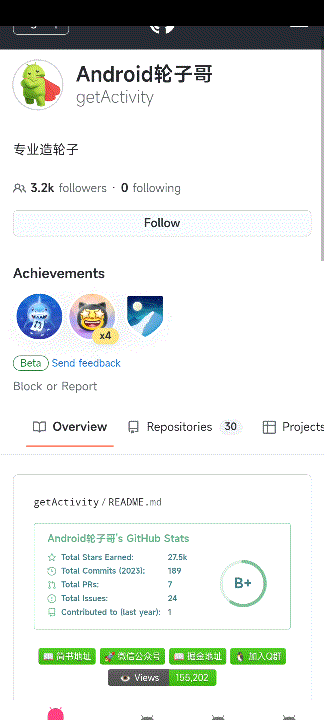

# [中文文档](README.md)

# Nested Scroll Layout

* Project address: [Github](https://github.com/getActivity/NestedScrollLayout)

* [Click here to download demo apk directly](https://github.com/getActivity/NestedScrollLayout/releases/download/2.0/NestedScrollLayout.apk)

* As we all know, WebView, LinearLayout, FrameLayout, and RelativeLayout do not support the NestedScroll feature, so this library was created specifically to solve this problem.



#### Integration Steps

* If your project's Gradle version is below `7.0`, you need to add the following to the `build.gradle` file:

```groovy
allprojects {
    repositories {
        // JitPack remote repository: https://jitpack.io
        maven { url 'https://jitpack.io' }
    }
}
```

* If your Gradle version is `7.0` or above, you need to add the following to the `settings.gradle` file:

```groovy
dependencyResolutionManagement {
    repositories {
        // JitPack remote repository: https://jitpack.io
        maven { url 'https://jitpack.io' }
    }
}
```

* After configuring the remote repository, add the remote dependency in the `build.gradle` file under the app module:

```groovy
android {
    // Supports JDK 1.8 and above
    compileOptions {
        targetCompatibility JavaVersion.VERSION_1_8
        sourceCompatibility JavaVersion.VERSION_1_8
    }
}

dependencies {
    // Nested Scroll Layout: https://github.com/getActivity/NestedScrollLayout
    implementation 'com.github.getActivity:NestedScrollLayout:2.0'
}
```

* Option 1: Use remote dependencies of the old version framework

```groovy
dependencies {
    // Nested Scroll Layout: https://github.com/getActivity/NestedScrollLayout
    implementation 'com.github.getActivity:NestedScrollLayout:2.0'
}
```

* Option 2: If your project is still in the Support phase and it's not convenient to migrate to **AndroidX** yet, but you want to use the latest version of the framework, you can use the [JetifierStandalone](https://developer.android.com/tools/jetifier#install) tool provided by **Google** to convert the **aar** packages from the released Release versions into **Support-compatible aar** packages using reverse mode.

* You can choose either of the above two options, but it's still not recommended. These are only stopgap measures, not long-term solutions. Subsequent versions of the framework will no longer support **Support** projects. The best approach is to migrate your project to **AndroidX**.

#### Framework Usage

* NestedScrollWebView

```xml
<com.hjq.nested.scroll.layout.NestedScrollWebView
    xmlns:android="http://schemas.android.com/apk/res/android"
    android:layout_width="match_parent"
    android:layout_height="match_parent" />
```

* NestedScrollFrameLayout

```xml
<com.hjq.nested.scroll.layout.NestedScrollFrameLayout
    android:layout_width="match_parent"
    android:layout_height="match_parent">
    
</com.hjq.nested.scroll.layout.NestedScrollFrameLayout>
```

* NestedScrollLinearLayout

```xml
<?xml version="1.0" encoding="utf-8"?>
<com.hjq.nested.scroll.layout.NestedScrollLinearLayout
    android:layout_width="match_parent"
    android:layout_height="match_parent"
    android:orientation="vertical">

</com.hjq.nested.scroll.layout.NestedScrollLinearLayout>
```

* NestedScrollRelativeLayout

```xml
<?xml version="1.0" encoding="utf-8"?>
<com.hjq.nested.scroll.layout.NestedScrollRelativeLayout
    android:layout_width="match_parent"
    android:layout_height="match_parent">

</com.hjq.nested.scroll.layout.NestedScrollRelativeLayout>
```

* NestedScrollViewPager

```xml
<com.hjq.nested.scroll.layout.NestedScrollViewPager
    android:layout_width="match_parent"
    android:layout_height="match_parent"
    app:layout_behavior="@string/appbar_scrolling_view_behavior" />
```

#### Open Source Project List

* Android middle office: [AndroidProject](https://github.com/getActivity/AndroidProject)

* Android middle office kt version: [AndroidProject-Kotlin](https://github.com/getActivity/AndroidProject-Kotlin)

* Permissions framework: [XXPermissions](https://github.com/getActivity/XXPermissions)  

* Toast framework: [Toaster](https://github.com/getActivity/Toaster)

* Network framework: [EasyHttp](https://github.com/getActivity/EasyHttp)

* Title bar framework: [TitleBar](https://github.com/getActivity/TitleBar)

* Floating window framework: [EasyWindow](https://github.com/getActivity/EasyWindow)

* Device compatibility framework：[DeviceCompat](https://github.com/getActivity/DeviceCompat)  

* Shape view framework: [ShapeView](https://github.com/getActivity/ShapeView)

* Shape drawable framework: [ShapeDrawable](https://github.com/getActivity/ShapeDrawable)

* Language switching framework: [Multi Languages](https://github.com/getActivity/MultiLanguages)

* Gson parsing fault tolerance: [GsonFactory](https://github.com/getActivity/GsonFactory)

* Logcat viewing framework: [Logcat](https://github.com/getActivity/Logcat)

* Android cmd tools：[AndroidCmdTools](https://github.com/getActivity/AndroidCmdTools)  

* Android version guide: [AndroidVersionAdapter](https://github.com/getActivity/AndroidVersionAdapter)

* Android code standard: [AndroidCodeStandard](https://github.com/getActivity/AndroidCodeStandard)

* Android resource summary：[AndroidIndex](https://github.com/getActivity/AndroidIndex)  

* Android open source leaderboard: [AndroidGithubBoss](https://github.com/getActivity/AndroidGithubBoss)

* Studio boutique plugins: [StudioPlugins](https://github.com/getActivity/StudioPlugins)

* Emoji collection: [EmojiPackage](https://github.com/getActivity/EmojiPackage)

* China provinces json: [ProvinceJson](https://github.com/getActivity/ProvinceJson)

* Markdown documentation：[MarkdownDoc](https://github.com/getActivity/MarkdownDoc)  

## License

```text
Copyright 2018 Huang JinQun

Licensed under the Apache License, Version 2.0 (the "License");
you may not use this file except in compliance with the License.
You may obtain a copy of the License at

   http://www.apache.org/licenses/LICENSE-2.0

Unless required by applicable law or agreed to in writing, software
distributed under the License is distributed on an "AS IS" BASIS,
WITHOUT WARRANTIES OR CONDITIONS OF ANY KIND, either express or implied.
See the License for the specific language governing permissions and
limitations under the License.
```